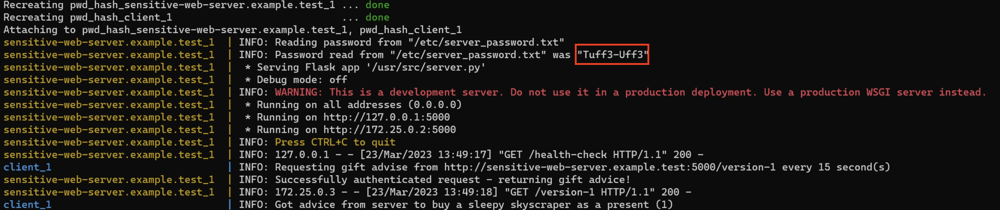
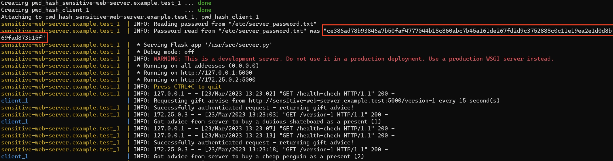

The first thing I did was write the script hash_the_password.py so that the password
is not stored in plain text. The reason I wrote a seperate script and didn't hash the password after the server is created
was because the file system in the docker container is read-only.

Ideally the client would hash the password before they send it to the server but since this was not the case I had to
implement the hashing on the server side, I did this by importing the hashlib library and adding the hashing in lines 95-97.

I also changed the logging so that the logging that takes place in line 47 is saved to log.info instead of log.debug
since I only wanted make sure that the password that the server was using was correct.

Lastly I formatted the script in Visual Studio Code using autopep8 which is why some lines look different while the code has not
actually changed.

Before we implemented hashing.

After we implemented hashing.
